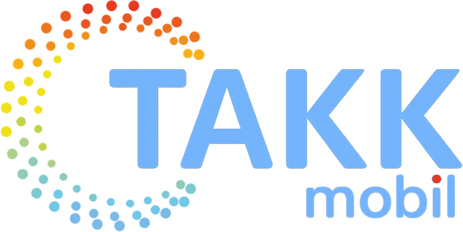

# TAKK - Tecken som Alternativ och Kompletterande Kommunikation

<p align="center">
  
</p>

<p align="center">
  <em>En mobilanpassad webbapplikation för att lära ut och träna svenskt teckenspråk som stöd (TAKK).<br>Utvecklad för intern användning inom Betaniahemmet.</em>
</p>

## 📖 Om TAKK

Betanias TAKK-app är en interaktiv lärplattform som hjälper användare att lära sig teckenspråk genom videobaserat material och interaktiva övningar. Appen innehåller över 80 tecken organiserade i progressiva nivåer.

### Funktioner

- **📚 Ordbok** - Bläddra genom alla tillgängliga tecken med videodemonstrationer
- **🎯 Träningsläge** - Öva på tecken i din egen takt med omedelbar feedback
- **📝 Quiz** - Testa dina kunskaper med flervalsfrågor
- **🏆 Tävlingsläge** - Utmana dig själv mot klockan och ta plats på leaderboarden
- **🌓 Mörkt läge** - Automatisk anpassning till systemets tema
- **📱 Mobilanpassad** - Responsiv design som fungerar på alla enheter

## 🛠️ Teknisk Stack

### Backend
- **Flask** - Python web framework
- **Gunicorn** - WSGI HTTP server för produktion
- **JSON-filer** - Enkel databas för leaderboard och feedback

### Frontend
- **React** - UI framework
- **Vite** - Build tool och dev server
- **Tailwind CSS** - Utility-first CSS framework
- **Radix UI** - Tillgängliga UI-komponenter

### Deployment
- **Nginx** - Reverse proxy och SSL
- **Systemd** - Service management
- **Ubuntu Server** - OS

## 🚀 Kom Igång

### Utvecklingsmiljö

#### Krav
- Python 3.10+
- Node.js 18+
- npm eller yarn

#### Installation

1. **Klona repot**
```bash
git clone https://github.com/betaniahemmet/takk_app.git
cd takk_app
```

2. **Sätt upp Python-miljö**
```bash
python3 -m venv venv
source venv/bin/activate  # På Windows: venv\Scripts\activate
pip install -r deployment/requirements.txt
```

3. **Installera frontend-dependencies**
```bash
cd app/components
npm install
cd ../..
```

4. **Starta utvecklingsservrar**

I en terminal (Flask):
```bash
python run.py
```

I en annan terminal (React):
```bash
cd app/components
npm run dev
```

Appen körs nu på:
- Backend: `http://localhost:5000`
- Frontend: `http://localhost:5173`

### Produktion

För produktionsdeploy, se detaljerade instruktioner i:
- **[deployment/DEPLOYMENT.md](deployment/DEPLOYMENT.md)** - Steg-för-steg guide
- **[deployment/DEPLOYMENT-PREP.md](deployment/DEPLOYMENT-PREP.md)** - Översikt och krav

#### Snabbstart för produktion

1. Följ [DEPLOYMENT.md](deployment/DEPLOYMENT.md)
2. Kör verifieringsskript:
```bash
sudo bash deployment/deployment-check.sh
```

## 📁 Projektstruktur

```
takk_app/
├── app/                          # Flask-applikation
│   ├── __init__.py              # App factory
│   ├── routes.py                # API endpoints
│   ├── leaderboard.py           # Leaderboard-logik
│   └── components/              # React frontend
│       ├── src/                 # React källkod
│       ├── public/              # Statiska filer
│       └── dist/                # Byggd frontend (skapas vid build)
├── catalog/                     # Data
│   ├── manifest.json           # Tecken och nivåer
│   ├── distractors.json        # Distraktorer för quiz
│   └── leaderboard.json        # High scores
├── media/                       # Media-filer
│   ├── signs/                  # Teckenvideoer (*.mp4)
│   └── ui/                     # UI-resurser
├── deployment/                  # Produktionskonfiguration
│   ├── DEPLOYMENT.md           # Deployment-guide
│   ├── gunicorn.conf.py        # Gunicorn-config
│   ├── nginx-takk.conf         # Nginx-config
│   ├── takk.service            # Systemd service
│   └── requirements.txt        # Python dependencies
├── raw_clips/                   # Råa videofiler (ej i git)
├── video_processing/            # Videobearbetning
└── run.py                       # Entry point
```

## 🎬 Videohantering

### Lägga till nya tecken

1. Placera råa videofiler i `raw_clips/`
2. Kör videobearbetning:
```bash
python video_processing/batch_processor.py
```
3. Uppdatera `catalog/manifest.json` med nya tecken
4. Bygg om React-appen

### Videokrav
- Format: .mov, .mp4, eller .avi
- Rekommenderad upplösning: 1080p
- Processerade videor sparas i `media/signs/`

## 🔧 Konfiguration

### Miljövariabler

Skapa `.env`-fil baserad på `.env.example`:

```bash
# Development
FLASK_ENV=development
FLASK_DEBUG=1

# Production  
FLASK_ENV=production
FLASK_DEBUG=0
```

### Anpassa innehåll

- **Tecken och nivåer**: Redigera `catalog/manifest.json`
- **Distraktorer**: Redigera `catalog/distractors.json`
- **Styling**: Anpassa i `app/components/tailwind.config.js`

## 📊 API Endpoints

### Tecken och Nivåer
- `GET /api/levels` - Hämta alla nivåer
- `GET /api/levels/:id` - Hämta specifik nivå
- `GET /api/levels/:id/cumulative` - Nivå + kumulativa tecken
- `GET /api/signs` - Hämta alla tecken

### Leaderboard
- `GET /api/scores` - Topp 10 scores
- `POST /api/score` - Lägg till ny score

### Övrigt
- `GET /api/distractors` - Hämta distraktorer
- `POST /api/feedback` - Skicka feedback
- `GET /health` - Health check

## 🧪 Testning

```bash
# Kör alla tester
pytest

# Kör specifikt test
pytest tests/test_api.py

# Med coverage
pytest --cov=app tests/
```

## 📝 Utvecklingsworkflow

1. **Skapa feature branch**
```bash
git checkout -b feature/ny-funktion
```

2. **Gör ändringar och testa lokalt**
```bash
python run.py
cd app/components && npm run dev
```

3. **Bygg frontend för produktion**
```bash
cd app/components
npm run build
```

4. **Commit och push**
```bash
git add .
git commit -m "Lägg till ny funktion"
git push origin feature/ny-funktion
```

5. **Deploy till server**
```bash
# På servern
cd /opt/takk
sudo -u takk git pull
sudo -u takk /opt/takk/venv/bin/python -m build app/components
sudo systemctl restart takk
```

## 🔒 Säkerhet

- Rate limiting på POST-endpoints (10 req/60s)
- Path traversal-skydd på mediaförfrågningar
- Input-validering på alla användardata
- CORS konfigurerad för lokal användning

## 🐛 Felsökning

### Backend
```bash
# Kolla Flask-loggar
tail -f /var/log/takk/error.log

# Kolla service status
sudo systemctl status takk

# Restart service
sudo systemctl restart takk
```

### Frontend
```bash
# Bygg om React-appen
cd app/components
npm run build

# Kolla build-fel
npm run build -- --debug
```

### Nginx
```bash
# Testa konfiguration
sudo nginx -t

# Reload nginx
sudo systemctl reload nginx

# Kolla loggar
sudo tail -f /var/log/nginx/takk-error.log
```

## 📦 Byggprocess

### Produktion build
```bash
# Backend - ingen build behövs för Flask
# Frontend - bygg React-appen
cd app/components
npm run build

# Output: app/components/dist/
```

## 🤝 Bidra

Detta projekt är för intern användning, men förslag och förbättringar är välkomna!

1. Diskutera förslaget i ett issue
2. Forka repot
3. Skapa din feature branch
4. Commita dina ändringar
5. Pusha till branchen
6. Öppna en Pull Request

## 📄 Licens

Detta projekt är licensierat under MIT License - se [LICENSE](LICENSE) för detaljer.

## 👥 Utvecklat för

**Betaniahemmet**  
En ideell förening som arbetar med stöd och boende för personer med funktionsnedsättning.

## 🙏 Tack till

- Alla som bidragit med teckenspråksvideoer
- Användarnas feedback och idéer
- Open source-communityn för de fantastiska verktygen

---

**Version:** 1.0.0  
**Status:** ✅ Produktionsklar  
**Senast uppdaterad:** November 2025